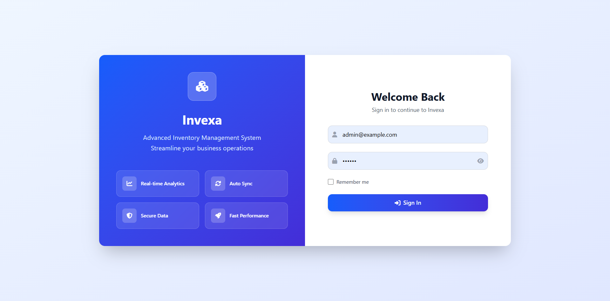

# Invexa - Advanced Inventory Management System

## Table of Contents

- [Installation](#installation)
- [User Credentials](#user-credentials)
- [Login](#login)

## Installation

### 1. Clone the repository

```
git clone https://github.com/alaminwebdev/invexa-inventory-system.git
cd invexa-inventory-system
```

### 2. Environment Setup

```
# Copy environment file
cp .env.example .env

# Update database configuration in .env
DB_CONNECTION=mysql
DB_HOST=127.0.0.1
DB_PORT=3306
DB_DATABASE=invexa
DB_USERNAME=root
DB_PASSWORD=
```

### 3. Generate Application Key

```
php artisan key:generate
```

### 4. Install Dependencies

```
# PHP dependencies
composer install

# Node.js dependencies
npm install
```

### 5. Database Setup

```
# Run migrations
php artisan migrate

# Seed the database
php artisan db:seed
```

### 6. Start Development Server

```
# Start Laravel development server
php artisan serve

# Start Vite for assets (in a new terminal)
npm run dev

```
## User Credentials

```
email - admin@example.com
password - 123456
```

## Login


